# Pet Hospital Project - 우태식, 문혜원, 홍의진, 김태현

# 1. 프로젝트 소개 및 선정 이유
---
이 프로젝트는 반려동물 보호자들이 쉽고 편리하게 동물병원 정보를 확인하고 다양한 진료 서비스를 이용할 수 있도록 제작한 웹사이트입니다.

병원 소개, 질의응답, 진료시간, 공지사항 등 필요한 정보를 한곳에서 제공하여 보호자들의 편의성을 높이고, 반려동물의 건강관리에 도움이 되는 웹 서비스를 구현하는 것을 목표로 하였습니다.

###  주요 기능

- 로그인 및 회원가입 기능
- 공지사항 확인
- 자유 게시판 및 의견 공유
- 고객 문의 페이지

# 2. 사용 기술
---
- HTML
- JavaScript
- Springboot
- Bootstrap
- Git
- GitHub
- IntelliJ

# 3. 팀원 역할
---

| 이름 | 담당 영역 |
|------|-----------|
| 우태식 | 공지사항 페이지 CRUD |
| 문혜원 | Q&A 페이지 CRUD |
| 홍의진 | 자유게시판 페이지 CRUD |
| 김태현 | 로그인 및 회원가입 페이지 CRUD |

# 4. 매핑 정보
---
| 설명 | 매핑 정보 | HTTP메서드·메서드명 | VIEW 처리 결과 |
|------|----------|--------------------|------------------|
| 공지게시판 목록 | /pethp/notice/list | GET·noticeList() | client/pethp/notice/list |
| 공지게시판 글 등록 화면 | /pethp/notice/write | GET·noticeWrite() | client/pethp/notice/write |
| 공지게시판 글 등록 처리 | /pethp/notice/write | POST·noticeInsert() | redirect:/pethp/notice/list |
| 공지게시판 상세 조회 | /pethp/notice/detail/{noticeNumber} | GET·noticeDetail() | client/pethp/notice/detail |
| 공지게시판 수정 화면 | /pethp/notice/ue/{noticeNumber} | GET·updateForm() | client/pethp/notice/update |
| 공지게시판 수정 처리 | /pethp/notice/{noticeNumber}/update  | POST·noticeUpdate() | redirect:/pethp/notice/{noticeNumber} |
| 공지 게시판 삭제 처리 | /pethp/notice/{noticeNumber}/delete | POST·noticeDelete() | redirect:/pethp/notice/list |
| 자유 게시글 목록 페이지 조회 | /pethp/list | GET·boardList() | client/pethp/list |
| 자유 게시글 작성 폼(화면) 이동 | /pethp/write | GET·writeForm() | client/pethp/write | 
| 자유 게시글 DB 등록 처리 | /pethp/write | POST·boardInsert() | redirect:/pethp/list |
| 자유 게시글 상세 조회 | /pethp/detail/{regNum} | GET·detail() | client/pethp/detail |
| 자유 게시글 수정 폼 | /pethp/update/{regNum} | GET·modifyForm() | client/pethp/update |
| 기존 게시글 DB 수정 처리 | /pethp/update/{regNum} | POST·modifyBoard() | redirect:/pethp/detail/{regNum} |
| 자유 기존 게시글 DB 수정 처리 | /pethp/delete/{regNum} | POST·deleteBoard() | redirect:/pethp/list |
| Q&A목록 조회 | /pethp/qna	 | GET·qnaList() | client.pethp/qna |
| Q&A글쓰기 화면 | /pethp/qna-write | GET·qnaWriteForm() | client/pethp/qnaWrite |
| Q&A 글 등록 처리 | /pethp/qna-write | POST·qnaInsertForm() | redirect:/pethp/qna |
| Q&A 상세조회 | /pethp/qna/{qnaNumber} | GET·qnaDetail() | client/pethp/qnaDetail |
| Q&A 삭제처리 | /pethp/qna/delete | POST·qnaDelete() | redirect:/pethp/qna |
| 회원가입 화면 이동  | /register | GET·registerForm()    | client/register.html |
| 회원가입 처리     | /register | POST·registerInsert() | 성공: redirect:/ 실패: client/register.html |
| 로그인 화면 이동   | /login | GET·loginForm() | client/login.html |
| 로그인 처리      | /login | POST·login() | 성공: redirect:/ 실패: client/login.html |
| 로그아웃 처리     | /logout | GET·logout() | redirect:/ |
| 마이페이지 화면 이동 | /mypage | GET·mypage() | 로그인 상태: client/mypage.html 비로그인 상태:redirect:/login |
| 회원정보 수정 처리  | /mypage/update | POST·mypageUpdate() | 성공:redirect:/mypage 실패:client/mypage.html |

# 5. 이미지
---

## 5-1. Main Page

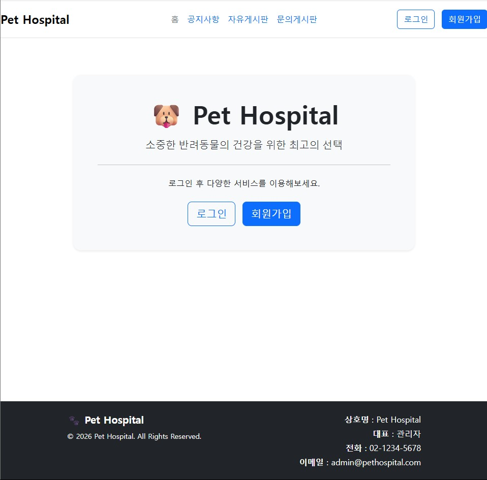

### 설명
메인페이지에서는 병원 배너를 통해 로그인 및 회원가입을 할 수 있습니다. 헤더 부분의 라벨을 통해서 각 게시판을 이용할 수 있습니다.

---

## 5-2.1 Login Page

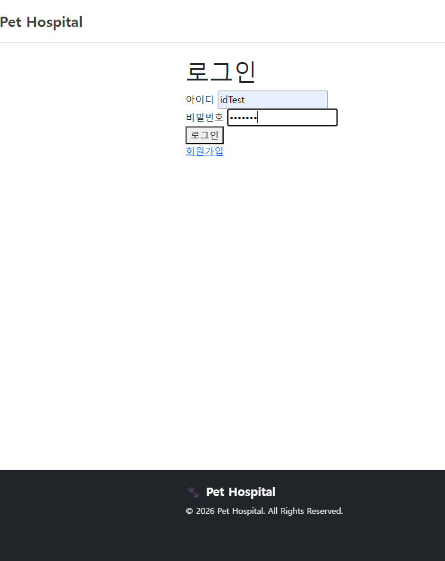

### 설명
로그인 페이지입니다. 회원가입 버튼을 누르면 회원가입 페이지로 넘어가며 회원가입된 아이디 및 비밀번호로 로그인 할 수 있습니다.

---

## 5-2.2 Register Page

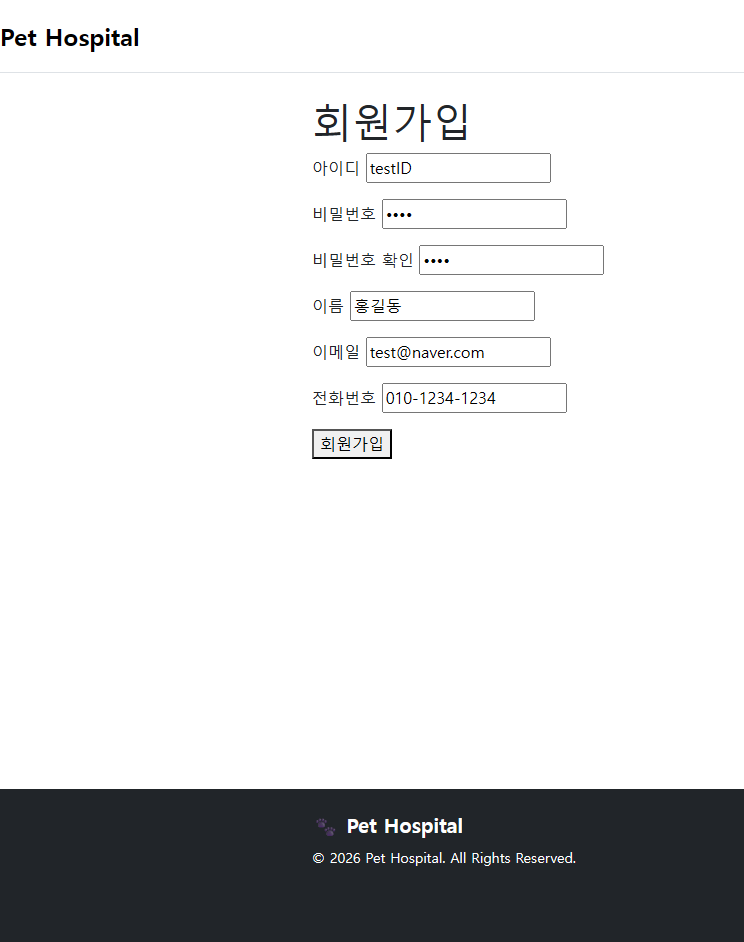

### 설명
회원가입 페이지입니다. 회원의 정보를 모두 입력하셔야 하고, 아이디 및 비밀번호는 정규표현식에 맞게 입력해야 회원가입이 가능합니다.

---

## 5-2.3 LoginMain Page

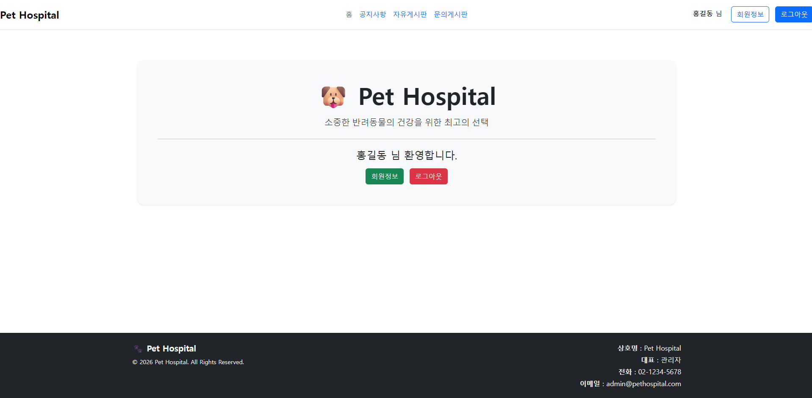

### 설명
로그인 메인 페이지입니다. 로그인을 하게 되면 메인 페이지로 이동하며 회원정보 버튼을 누르면 회원정보를 볼 수 있으면 로그아웃 버튼을 누르면 로그아웃합니다.

---

## 5-2.4 UserInfo Page

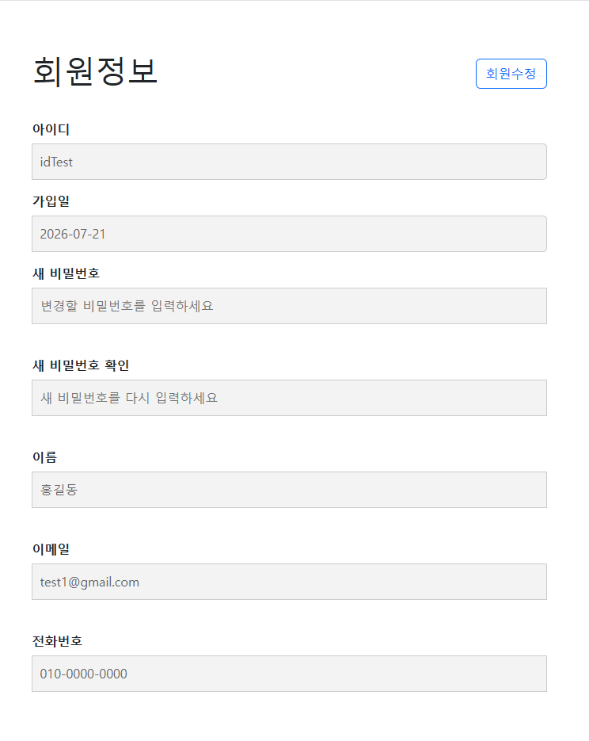

### 설명
회원정보 페이지입니다. 로그인 당시에 회원정보를 볼 수 있으며 회원수정 버튼을 누를시 회원정보 수정을 할 수 있습니다.

---

## 5-2.5 UserInfoModify Page

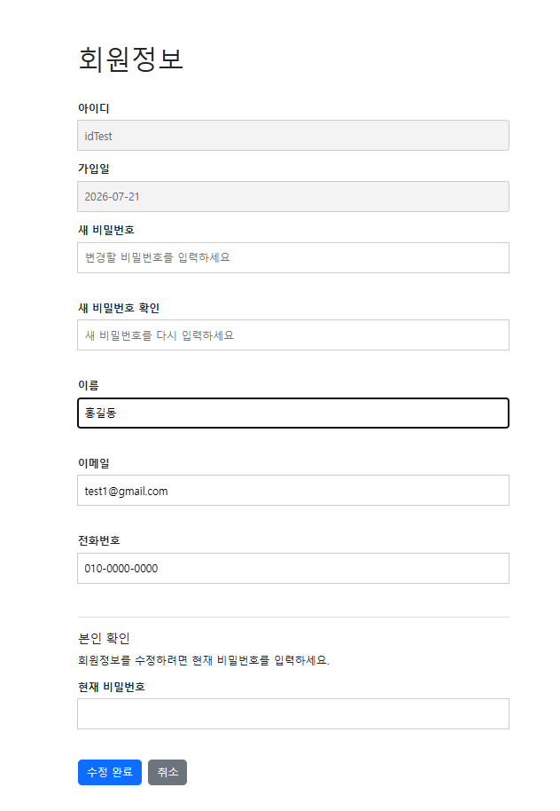

### 설명
회원정보 수정 페이지입니다. 비밀번호, 이름, 이메일, 전화번호를 수정할 수 있으며 현재 비밀번호를 입력해야 수정이 가능합니다.

## 5-3.1 Notice Page

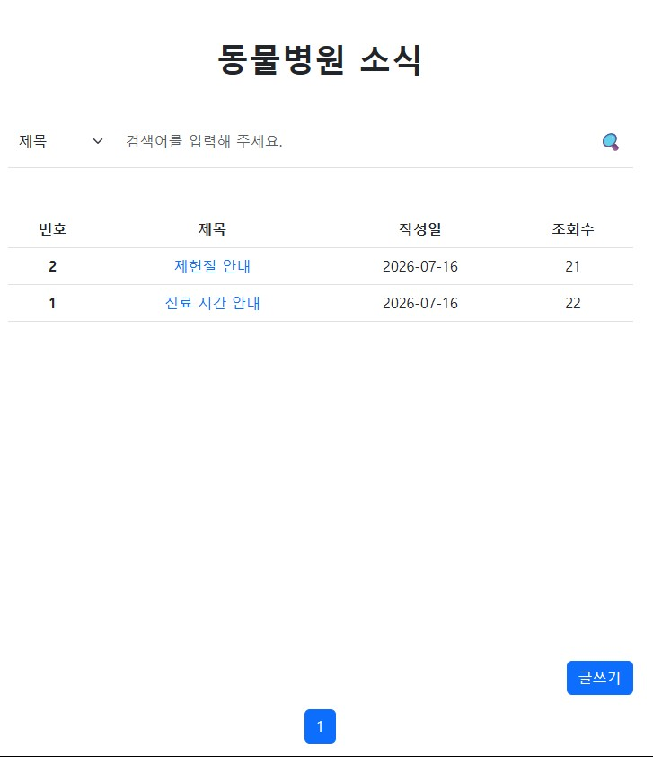

### 설명
공지사항 목록을 볼 수 있는 페이지입니다. 한페이지당 10개의 게시글로 페이징 처리 하였으며 제목을 누를시 조회수가 증가하며 상세페이지로 이동합니다. 관리자만 글쓰기 버튼을 통해서 글을 쓸 수 있습니다.

---

## 5-3.2 NoticeWrite Page

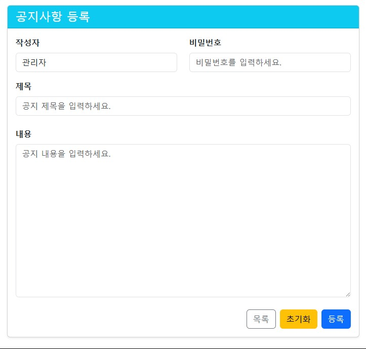

### 설명
공지사항을 쓸 수 있는 페이지입니다. 목록 버튼을 통해 공지 게시글 목록으로 갈 수 있으며 초기화 버튼을 누를시 입력값이 모두 초기화 됩니다. 등록 버튼을 누르면 공지사항에 등록됩니다.

---

## 5-3.3 NoticeDetail Page

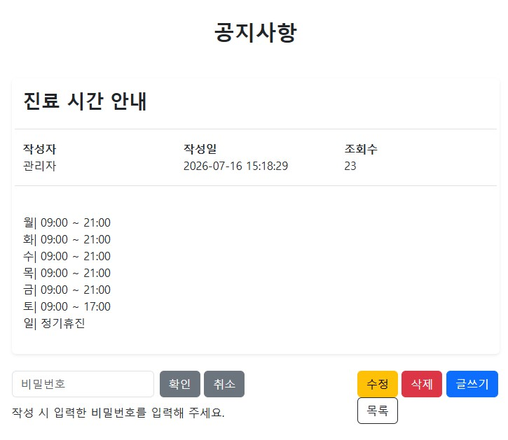

### 설명
공지사항 상세 페이지입니다. 수정 및 삭제 버튼을 누르면 왼쪽 하단 비밀번호 입력칸이 활성화 되며 비밀번호가 같을 경우 수정페이지 이동 및 삭제가 가능합니다.

---

## 5-3.4 NoticeUpdate Page

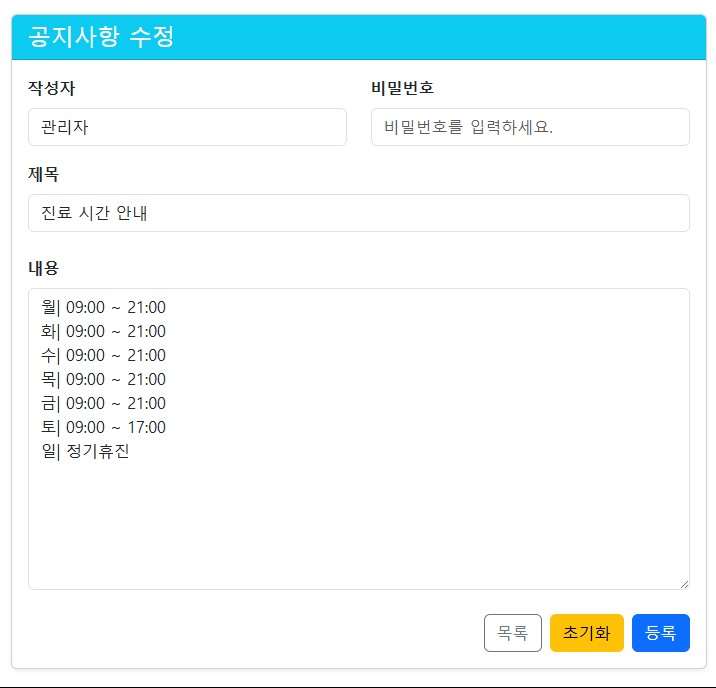

### 설명
공지사항 수정 페이지입니다. 입력 당시 비밀번호를 입력해야 수정이 가능합니다.

---

## 5-4.1 Freeboard Page

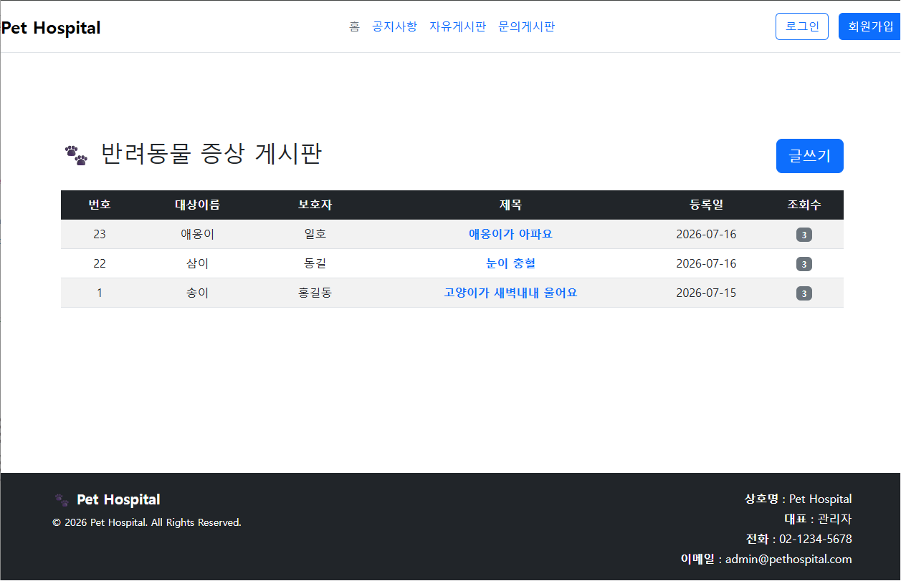

### 설명
자유게시판 목록을 볼 수 있는 페이지입니다. 제목을 누를시 조회수가 증가하며 상세페이지로 이동합니다. 또한 글쓰기 버튼을 통해 누구나 게시글을 쓸 수 있습니다.

---

## 5-4.2 FreeboardWrite Page

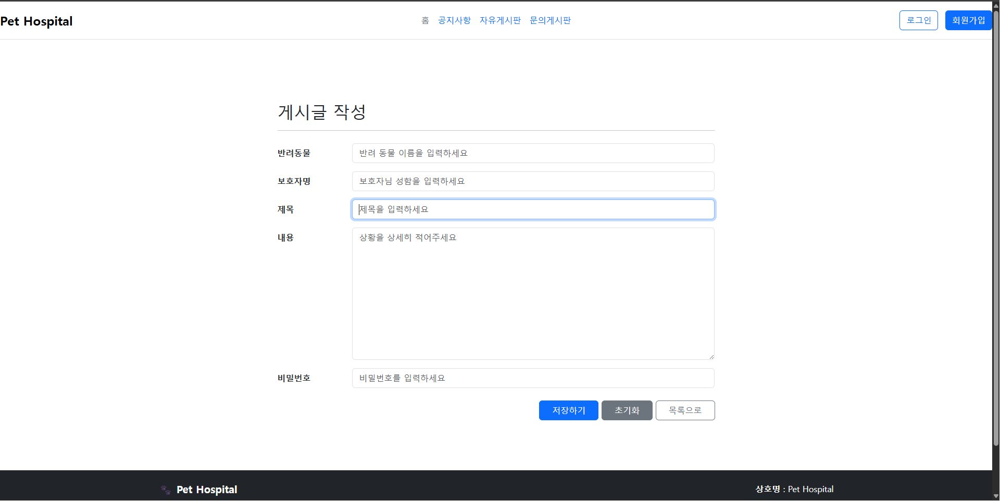

### 설명
자유 게시글을 쓸 수 있는 페이지입니다. 목록으로 버튼을 통해 자유 게시글 목록으로 갈 수 있으며 초기화 버튼을 누를시 입력값이 모두 초기화 됩니다. 등록하기 버튼을 누르면 공지사항에 등록됩니다.

---

## 5-4.3 FreeboardDetail Page

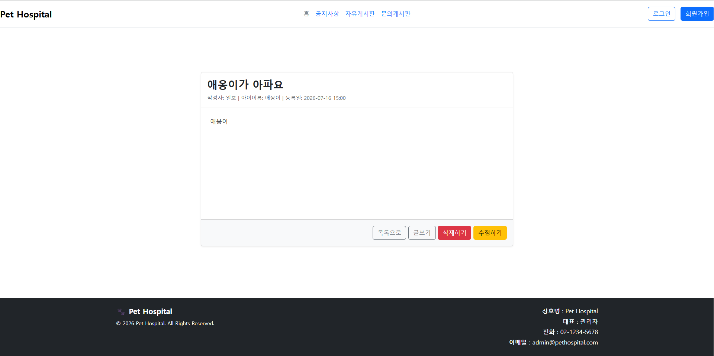

### 설명
자유 게시글 상세 페이지입니다. 수정하기 버튼을 누르면 수정페이지로 이동하고 삭제하기 버튼을 누르면 게시글을 삭제할 수 있습니다.

---

## 5-4.4 FreeboardUpdate Page

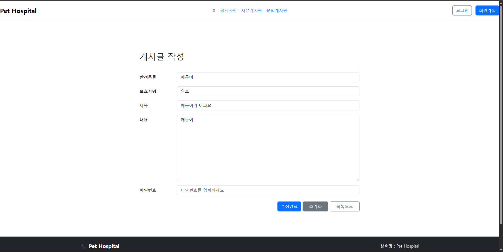

### 설명
자유 게시글 수정 페이지입니다. 수정완료 버튼을 통해서 수정이 가능하며 비밀번호를 입력시 비밀번호가 바꾸고 변경이 없을시 그대로 등록합니다.

---

## 5-5.1 Q&A Page

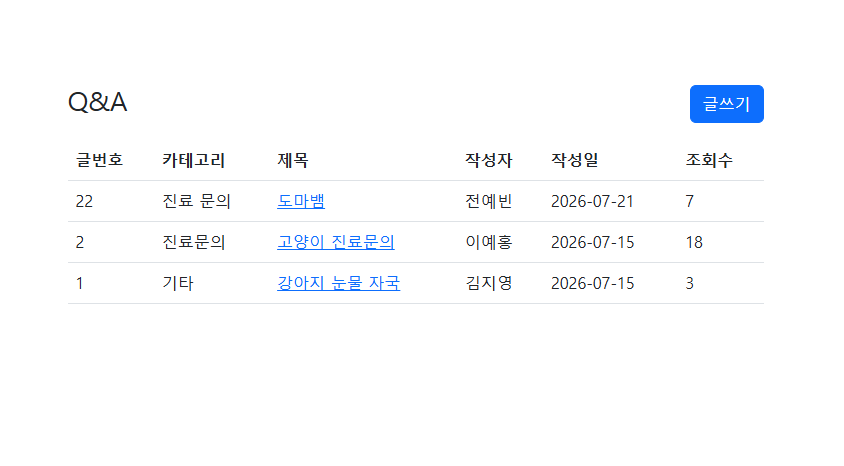

### 설명
문의게시글 목록을 볼 수 있는 페이지입니다. 제목을 누를시 조회수가 증가하며 상세페이지로 이동합니다. 또한 글쓰기 버튼을 통해 누구나 게시글을 쓸 수 있습니다.

---

## 5-5.2 Q&A Write Page

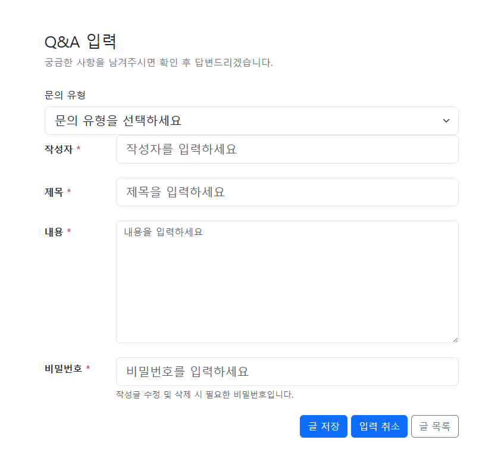

### 설명
문의게시글을 쓸 수 있는 페이지입니다. 문의 유형을 선택할 수 있으며 빈 칸 없이 작성해야 글을 저장할 수 있습니다. 입력 취소 버튼을 누르게 되면 입력값이 모두 초기화 됩니다. 글 목록으로 버튼을 통해 문의 게시글 목록으로 갈 수 있습니다.

---

## 5-5.3 Q&A detail Page

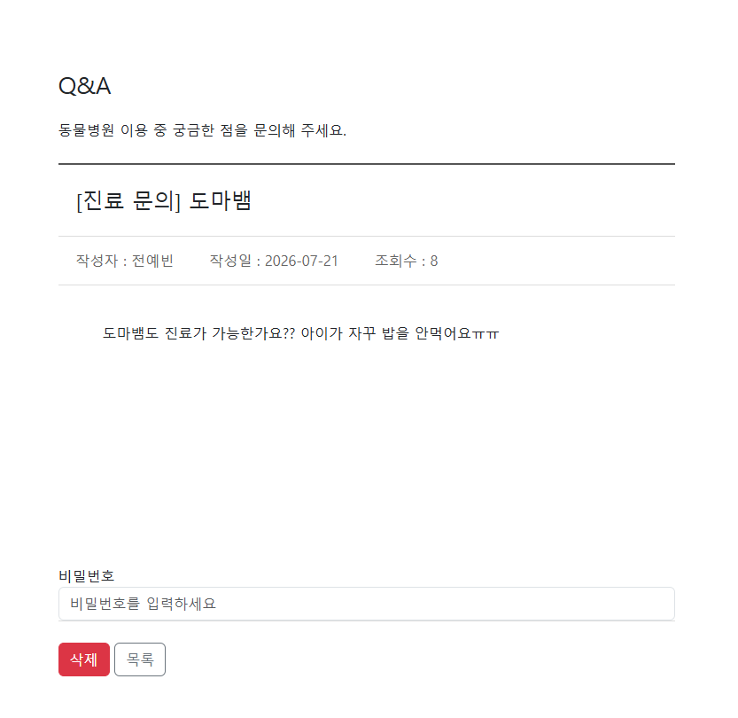

### 설명
문의 게시글 상세 페이지입니다. 비밀번호가 같을 시에 삭제가 가능합니다.

---
